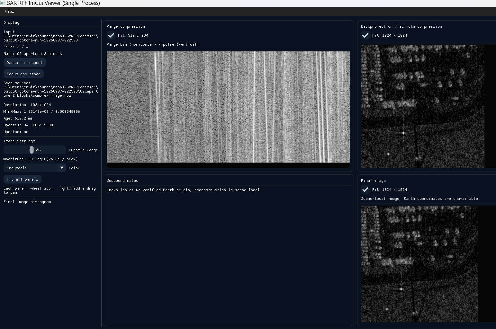

# SAR-Processor

Coherent SAR processing is available through the Python `sar_processing` package. The C++23 tools provide SarTape2 ingest, RPF parsing, PTA/QA, and native visualization.

| Input | Processing | Output |
| --- | --- | --- |
| Raw complex echoes, replica, timing, antenna positions | Linear matched-filter range compression and coherent geometric backprojection | Complex image and range profiles; geographic export with a supplied scene origin |
| GOTCHA frequency-domain phase histories | IFFT range profiles, coherent geometric backprojection, direct-sum numerical check | Complex image and range profiles; scene-local coordinates unless an Earth origin is supplied |
| Sandia FARAD X-band NITF | Decode magnitude/phase, inspect sensor metadata, preserve original coordinates, geocode magnitude | Complex GeoTIFF, magnitude GeoTIFFs, PNGs, and full-resolution geographic ImGui frames |

**The downloaded Sandia files are already focused complex SAR images.** Their I/Q information is encoded as magnitude and phase. Range and azimuth compression were performed by the producer. Applying those operations again would corrupt the image. GOTCHA supplies measured phase histories for testing image formation.

## Install and process real data

Python 3.11 or newer is required. From the repository root on Windows:

```powershell
py -3 -m venv .venv
.venv/Scripts/python.exe -m pip install -e ".[test]"

.venv/Scripts/python.exe -m sar_processing --format gotcha --input data/gotcha --output output/gotcha-processed --pixels 512 --upsample 32
.venv/Scripts/python.exe -m sar_processing --format sandia --input data/sandia/FARAD_X_BAND --output output/sandia-processed --resolution 0.25 --skip-viewer-raw
```

On Linux use `python3 -m venv .venv` and `.venv/bin/python`. After installation, `sar-process` is also available as a console command. Inputs must already be downloaded and extracted. Each command requires a **new output directory** and publishes it only after the complete run succeeds.

The Sandia command omits raw viewer payloads while retaining complex/magnitude GeoTIFFs and PNGs. Export the geocoded viewer sequence below when needed. Omitting the native-grid raw copy alone saves about 1.94 GB across 30 images; full-resolution geocoded playback requires additional disk and graphics memory.

Range and azimuth windows now accept `hann`, `none`, or configurable `taylor`. Backprojection supports bounded image tiles and optional complex windowed-sinc interpolation. An enhanced GOTCHA run is:

```powershell
.venv/Scripts/python.exe -m sar_processing --format gotcha --input data/gotcha --output output/gotcha-enhanced --pixels 512 --upsample 4 --window taylor --azimuth-window taylor --taylor-nbar 4 --taylor-sll-db 35 --interpolation sinc --tile-pixels 65536
```

Defaults remain Hann/32-times upsampling/linear interpolation. A measured GOTCHA comparison found sinc more accurate against the direct frequency sum, with greater processing cost; the [benchmark and processing contracts](docs/real-data-processing.md#interpolation-and-response-measurements) describe that tradeoff. Optional known-reference phase correction and DEM-supported geometry require independently verified target/origin/datum information. Neither was applied to the local measured datasets.

## View each scan and its processing stages in ImGui

The AFRL GOTCHA dashboard shows range compression, backprojection / azimuth compression, and the final image together for the same aperture. The geocoordinates panel explains when a verified Earth origin is unavailable.



*Figure 1. AFRL GOTCHA processing in the ImGui dashboard: range profiles (top left), backprojection / azimuth compression (top right), geocoordinate status (bottom left), and final image (bottom right). The displayed reconstruction is 1024 × 1024 pixels.*

The Direct RPF ImGui viewer also reads `.sarframe` scientific products. Export the existing geocoded GeoTIFFs without reprocessing the source measurements, then open their sequence. These commands assume the graphics-enabled executable is built under `build/Debug`:

```powershell
.venv/Scripts/python.exe -m sar_processing.viewer --input output/sandia-processed --output output/scientific-viewer/sandia-geocoded
.venv/Scripts/python.exe -m sar_processing.stages --input output/scientific-viewer/sandia-geocoded
.\build\Debug\sar_imgui_rpf_viewer_cli.exe --input-dir output\scientific-viewer\sandia-geocoded --validate-inputs
.\build\Debug\sar_imgui_rpf_viewer_cli.exe --input-dir output\scientific-viewer\sandia-geocoded --publish-sleep-ms 250 --loop
```

The export directory must be new. Skip the first command when the sequence exists, and skip stage export when its `scan.sarscan` bundles already exist. A fresh Sandia processing run without `--skip-viewer-raw` creates `.sarframe` products directly in its output subdirectories; stage export and the viewer can use that output directory instead.

- The file counter advances through the 30 distinct images and loops. The 250 ms option is a delay between publications; loading and rendering large images also take time.
- Mouse wheel zooms; right-drag or middle-drag pans. **Pause to inspect** freezes the displayed frame; **Resume playback** returns to incoming frames.
- The default dashboard shows **Range compression**, **Azimuth compression / backprojection**, **Geocoordinates**, and **Final image** together for the same scan. A missing stage shows its reason. Sandia's azimuth panel shows the producer-focused native image and identifies its upstream processing.
- Single-stage inspection remains available for phase or a larger image. Selecting a stage pauses the current scan; phase uses radians rather than logarithmic amplitude scaling.
- Hover shows the displayed raster's pixel index, value, and latitude/longitude when available. Intermediate previews use their own raster indices; the final frame retains full resolution. A geographic interpolation estimate is shown separately from unknown absolute accuracy.
- Adjust logarithmic dynamic range and color map without changing the scientific values. Filtered display reduction retains the original full-resolution payload for inspection.

Sandia defaults to the final **geocoded magnitude**, with source provenance and nodata preserved. Intermediate stage previews are limited to 512 pixels per axis; the full scientific GeoTIFF/NPZ data remain available at the recorded source paths, and the existing final viewer payload retains full resolution. This is playback of completed acquisitions, with no claim of live SAR computation or a continuous radar time series.

To play the four measured GOTCHA azimuth blocks with actual range profiles, backprojected magnitude, and phase, prepare each block once:

```powershell
foreach ($az in 1..4) {
    $run = 'output/scientific-viewer/gotcha-stages/az{0:000}' -f $az
    .venv/Scripts/python.exe -m sar_processing --format gotcha --input data/gotcha --output $run --first-az $az --last-az $az --pixels 512 --upsample 4 --window taylor --azimuth-window taylor --interpolation sinc
    .venv/Scripts/python.exe -m sar_processing.stages --input $run
}
.\build\Debug\sar_imgui_rpf_viewer_cli.exe --input-dir output\scientific-viewer\gotcha-stages --publish-sleep-ms 500 --loop
```

These blocks are different aperture portions of the same pass. They have no verified Earth origin, so the geocoordinates panel explains that limitation. Open `output/scientific-viewer` to play all 34 prepared scan bundles with four synchronized panels. `--stage range` or another stage ID opens a single-stage view when desired; an unavailable selection falls back to the current scan's default with an explanation.

For a graphics regression check, use `--render-check-frames 4` on the GOTCHA sequence. Unlike `--validate-inputs`, this creates an OpenGL window and checks actual rendered panels; unavailable stages retain their explanations. Add `--stage range` to check that single-stage view. `--render-capture output/pipeline-render.ppm` saves the first render. Run desktop validation from the same account that will open the viewer.

See [real-data processing](docs/real-data-processing.md) for data sources, raw-input schema, geocoding conventions, output files, and acceptance tests.

## Verification and robustness

The Python range-compression and geometric-backprojection path has passed numerical verification on the local GOTCHA subset. It still requires accurate waveform, timing, and antenna-position metadata; the results below do not establish general field or production qualification. This assessment applies to the Python products displayed by ImGui. The [legacy native FFT demonstration](#existing-sartape2-and-rpf-workflow) is a separate implementation.

### Measured-data numerical verification

The 2026-09-07 verification used all four local GOTCHA MAT files: 469 pulses with 424 frequency samples per pulse. Four cumulative apertures were reconstructed on 1024-by-1024 grids using Taylor range/azimuth windows, 32-times range upsampling, and linear interpolation.

| Check | Observed result |
| --- | --- |
| Focused processing, GOTCHA-reader, and reference-phase-correction tests | 250 passed, 0 failed |
| Independent direct frequency sum from original MAT samples | 1,024 saved pixels checked per aperture; maximum complex relative L2 error across the four comparisons was **0.066991%** |
| Deliberately incorrect phase sign, one-way delay, or omitted reference range | All rejected by the numerical comparison |
| Independently translated NGA/AFRL backprojection equations | Agreement within **3.0e-10%** complex relative L2 error over 289 pixels, with matching windows and normalization |
| Final viewer payload against saved complex-image magnitude | All **4,194,304** float32 pixels matched exactly |

The equation comparison used a Python/SciPy translation of [NGA/AFRL's `bpBasic.m`](https://github.com/ngageoint/MATLAB_SAR/blob/master/Processing/IFP/BP/bpBasic.m); the original MATLAB program was not executed. The reported errors measure numerical agreement, not surveyed target-location accuracy, achieved spatial resolution, or radiometric calibration. Interpolation and fitting the stored float32 frequencies to a uniform IFFT grid account for residual numerical differences.

### Synthetic stress characterization

Noise, pulse-loss, and position-error cases used a synthetic isolated stationary target with the actual GOTCHA antenna positions and frequencies. Each stress level used three seeded trials on a 41-by-41 grid with 0.05 m spacing, Taylor windows, 32-times upsampling, and linear interpolation. These are bounded experiments; the target echoes in these cases are synthetic.

| Stress | Observed result and scope |
| --- | --- |
| White complex noise at -20 dB input SNR per frequency/pulse sample | Target peak remained on the correct grid pixel in all three trials; target complex error relative to the clean result was 1.17-2.36% |
| Random removal of 10%, 30%, or 50% of whole pulses | Target peak stayed correctly located with aligned geometry/reference metadata; no added noise or clutter in these cases |
| Independent Gaussian residual line-of-sight position error, 1 mm standard deviation | Retained 92-93% of clean target amplitude |
| Same position-error model, 3 mm standard deviation | Retained only 49-52% of clean target amplitude |
| Synthetic raw-chirp matched filtering | Agreed with independent direct correlation to floating-point precision; output noise power agreed with predictions within 1.3% across 512 trials per window/SNR condition |
| 5% reference chirp-rate mismatch | Peak amplitude fell to about 50% and the peak shifted by two samples for the tested 256-sample chirp with time-bandwidth product 128 |

The position experiment perturbed reconstruction positions while retaining the original reference ranges. It characterizes residual path error, not a common navigation offset canceled by consistent motion compensation. The pulse-loss result does not establish sidelobe, clutter, burst-loss, or detection performance. Raw-chirp tests are synthetic: GOTCHA validates frequency-domain phase-history processing, and the local Sandia NITFs are already focused images.

The implementation rejects nonfinite samples, inconsistent metadata, unsupported nonuniform frequency grids, out-of-swath image requests, and allocations beyond configured limits. It does not automatically repair interference, clipping, corrupted pulses, or unknown motion errors. Known-reference phase correction requires an independently identified stable scatterer; general blind autofocus, moving-target focusing, calibrated radiometry, surveyed ground-truth validation, and endurance qualification remain gaps.

Detailed local reports are `output/gotcha-resolution-20260907053448/backprojection-verification.json` and `output/gotcha-resolution-20260907053448/robustness-characterization.json`. These generated reports are workspace artifacts and are not included in a fresh checkout. The focused automated checks can be rerun with:

```powershell
.venv/Scripts/python.exe -m pytest tests/python/test_processing.py tests/python/test_gotcha.py tests/python/test_autofocus.py -q
```

The independent saved-image comparisons and stress sweeps above were separate local experiments; this test command does not recreate those reports.

## Test

```powershell
.venv/Scripts/python.exe -m ruff check sar_processing tests/python conanfile.py
.venv/Scripts/python.exe -m ruff format --check sar_processing tests/python conanfile.py
.venv/Scripts/python.exe -m mypy sar_processing
.venv/Scripts/python.exe -m pytest --cov=sar_processing --cov-branch --cov-report=term-missing --cov-report=json:build/python-coverage.json
```

Portable tests use independent point-target calculations, chirp correlation, and actual small MAT, NPZ, NITF, and GeoTIFF fixtures. CI separately requires at least 90% line and branch coverage for every Python module. Large measured-data checks are opt-in after preparing the baseline GOTCHA/Sandia outputs, enhanced GOTCHA output, full-resolution Sandia viewer sequence, four GOTCHA aperture runs, and all 34 stage bundles with the commands above:

```powershell
$env:SAR_MEASURED = '1'
.venv/Scripts/python.exe -m pytest tests/python/test_measured.py -q
Remove-Item Env:SAR_MEASURED
```

## Build native tools

Requirements: CMake 3.20+, C++23 compiler, and Conan 2. The following builds the native core and tests without graphics dependencies:

```powershell
$env:CONAN_HOME = Join-Path (Get-Location) 'build/.conan2'
conan profile detect --force
conan install . --build=missing --output-folder=build -pr:h=conan/profiles/msvc194-host-debug -pr:b=conan/profiles/msvc194-build-release -o:h '&:with_viewers=False'
cmake -S . -B build -G "Visual Studio 17 2022" -A x64 -DCMAKE_TOOLCHAIN_FILE=conan_toolchain.cmake -DBUILD_TESTING=ON -DSAR_BUILD_VIEWERS=OFF
cmake --build build --config Debug --parallel 4
ctest --test-dir build -C Debug --output-on-failure
```

On Linux:

```bash
export CONAN_HOME="$PWD/build/.conan2"
conan profile detect --force
conan install . --build=missing --output-folder=build -s build_type=Release -s compiler.cppstd=23 -o:h '&:with_viewers=False'
cmake -S . -B build -DCMAKE_TOOLCHAIN_FILE=conan_toolchain.cmake -DCMAKE_BUILD_TYPE=Release -DBUILD_TESTING=ON -DSAR_BUILD_VIEWERS=OFF
cmake --build build --parallel 4
ctest --test-dir build --output-on-failure
```

For ImGui viewers, configure a separate build directory with Conan `with_viewers=True` and CMake `SAR_BUILD_VIEWERS=ON`; OpenGL and platform window-system dependencies are then required. Generated `image.raw` files use the existing viewer's little-endian width/height/float32 format. Example with viewer binaries built under `build-viewers/Debug`:

```powershell
.\build-viewers\Debug\rto_visualizer_cli.exe --cached-raw output\gotcha-processed\image.raw --shared-file output\rto_shared.bin --frames 300 --interval-ms 33
.\build-viewers\Debug\sar_imgui_viewer_cli.exe --shared-file output\rto_shared.bin
```

The legacy Direct RPF mode still plays a directory of RPF images in a loop. The earlier Sandia display previews remain available in this workspace:

```powershell
.\build\Debug\sar_imgui_rpf_viewer_cli.exe --input-dir output\sandia-rpf-sequence --frame 1 --frame-mode file-index --preview-width 1024 --preview-height 1024 --publish-sleep-ms 250 --loop
```

These RPFs are display previews generated separately from the processing CLI; their geographic annotations are placeholders. Use the `.sarframe` workflow above for full-resolution geocoded Sandia inspection. `output/sandia-viewer-manifest.json` maps the older RPF previews to their original products and records their pixel-by-pixel reader verification. RPF `--frame-mode file-index` advances the internal frame argument with the file index; `.sarframe` products are individual images and do not need that option.

## Existing SarTape2 and RPF workflow

`pipeline_runner_cli --sartape <input> --out <directory>` and `--rpf <input.rpf>` remain available. The native `BackProjectionEngine` currently performs a **legacy magnitude/2D FFT demonstration**. Its report now identifies that algorithm explicitly; it is not the coherent processing implementation described above. Missing input fails, and synthetic demonstration input requires `allowSyntheticInput=true` with no input filename.

The SarTape2 generator and the Python raw-echo contract have different carrier-phase conventions. There is currently no coherent SarTape2-to-Python adapter. Use the documented NPZ contract for raw processing, and the Python CLI for GOTCHA and Sandia.

The native comparison CLI checks equal dimensions, finite values, and per-pixel `abs(actual-reference) <= atol + rtol*abs(reference)`. Defaults require exact equality. Exit codes are 0 for a match, 2 for numerical mismatch, and 1 for invalid input.
